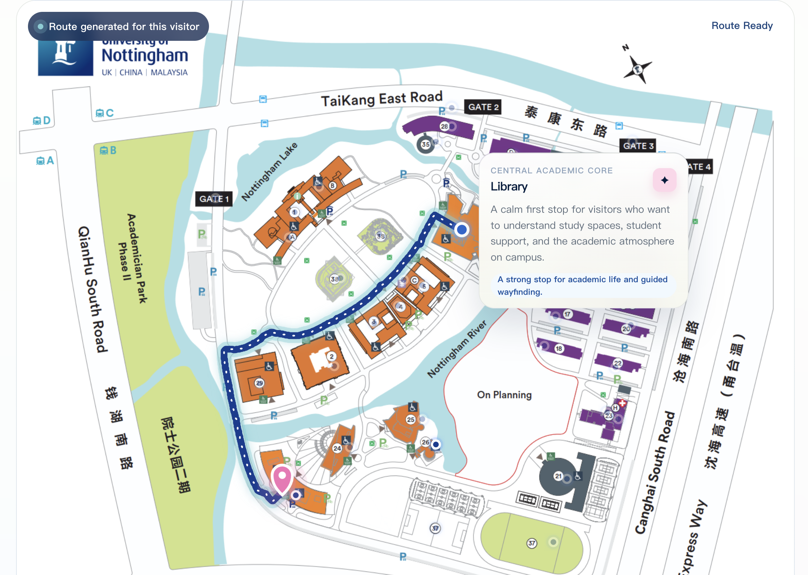
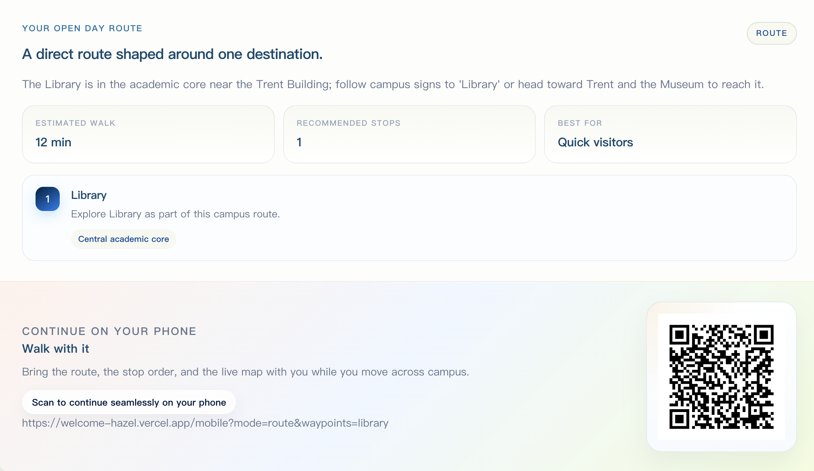

<p align="center">
  
</p>

<h1 align="center">UNNC Open Day AI Guide</h1>

<p align="center">
  <strong>校园开放日 AI 导览系统 — 语言理解 · 路线规划 · 语音交互 · 机械臂联动</strong>
</p>

<p align="center">
  <a href="./README.md">🇨🇳 中文</a> | <a href="./README_EN.md">🌐 English</a>
</p>

<p align="center">
  
  
  
  
  
</p>

<p align="center">
  访客说一句话，系统给一条路，屏幕画出来，手臂指出去，手机带着走。
</p>

<p align="center">
  <a href="https://bronze-stocking-bd4.notion.site/332664bfdad2806b8045d09fc30c7880">观看 Demo</a> · <a href="#-产品截图">产品截图</a> · <a href="#-快速开始">快速开始</a>
</p>

---

## 📖 目录

- [关于项目](#-关于项目)
- [产品截图](#-产品截图)
- [主要特性](#-主要特性)
- [产品流程](#-产品流程)
- [仓库结构](#-仓库结构)
- [快速开始](#-快速开始)
- [系统模块详解](#-系统模块详解)
- [拓展与商业潜力](#-拓展与商业潜力)
- [相关文档](#-相关文档)

---

## 🤔 关于项目

这是一个为 **University of Nottingham Ningbo China 校园开放日**设计的 AI 导览系统。

不仅仅是一个 FAQ 机器人，也不仅仅是一个静态地图页面，这是一条从**自然语言 → 意图理解 → 路径规划 → 地图展示 → 手机接续 → 语音播报 → 实体手臂指路**的完整链路！

访客可以说：

```
"图书馆怎么走？"
"我想了解理工区域"
"我对 AI 和机器人感兴趣"
"第一次来怎么逛比较好？"
```

系统会理解意图、规划真实可行走路线、在地图上高亮显示、用语音播报结果，同时旁边的机械臂会转向路线起步方向，然后生成一个二维码，访客扫一扫就能把**属于自己的个性化路线**带到手机上继续导航。

---

## 📸 产品截图

<p align="center">
  <strong>🗺️ 路线地图 — 真实可行走路径 + 点位信息卡片</strong>
</p>

<p align="center">
  
</p>

<p align="center">
  <strong>📋 导览结果 — 路线摘要 + 手机接续二维码</strong>
</p>

<p align="center">
  
</p>

---

## ✨ 主要特性

| | 特性 | 说明 |
|---|---|---|
| 🧠 | **自然语言导览** | LLM 结构化输出，支持单点问路 / 主题导览 / 推荐路线 / 追问澄清；无 API Key 时自动 fallback |
| 🗺️ | **真实路径规划** | 基于校园地图中心线 + **A\*** 算法，返回真实可行走的像素级折线 |
| 📱 | **桌面 ↔ 手机闭环** | 二维码不是跳首页，而是带 waypoint 状态的恢复链接；扫码即可在任意设备重建路线 |
| 🎙️ | **语音交互** | AssemblyAI (STT) + Cartesia (TTS)，含欢迎语、过渡语、结果播报与 fallback 话术池 |
| 🦾 | **机械臂联动** | SO-ARM101 人脸跟踪 + 八方向指路 + 多种表情动作，路线一出手臂就指 |
| 🔌 | **模块化工程** | 前后端分离、NLU / 路径 / 语音 / 机械臂各自解耦，可按场景替换知识库与地图 |

---

## 🚀 产品流程

```text
  访客输入（文字 / 语音）
          │
          ▼
  ┌─────────────────────┐
  │  前端交互层          │  桌面大屏 / 手机页面
  └────────┬────────────┘
           ▼
  ┌─────────────────────┐
  │  FastAPI 后端       │  路由分发 · 会话管理 · 语音代理
  └────────┬────────────┘
           ▼
  ┌─────────────────────┐
  │  NLU 意图理解        │  LLM structured output + fallback
  └────────┬────────────┘
           ▼
  ┌─────────────────────┐
  │  路线分流            │  route │ tour │ recommend_tour │ clarification
  └────────┬────────────┘
           ▼
  ┌─────────────────────┐
  │  A* 路径规划         │  centerline 路网 + 多点拼接
  └────────┬────────────┘
           ▼
  ┌────────┴───────────────────────────────────┐
  │              │              │              │
  ▼              ▼              ▼              ▼
 地图渲染      QR 接续       语音播报      机械臂动作
```

---

## 🏗️ 仓库结构

```text
welcome/
├── backend/                       # FastAPI 后端
│   ├── app/api/                   #   路由入口
│   ├── app/services/              #   NLU · 路径规划 · 导览编排 · 语音代理 · 机械臂联动
│   ├── app/models/                #   Schema & 数据结构
│   ├── app/data/                  #   校园知识库 · 主题配置 (campus.yaml)
│   └── map/                       #   底图 · 点位 · 中心线
├── frontend/                      # Vite + React + TypeScript
│   ├── src/pages/                 #   桌面导览页 · 手机接续页
│   ├── src/components/            #   复用 UI 组件
│   └── src/voice/                 #   语音状态机 · 话术池
├── arm_driver/                    # SO-ARM101 机械臂驱动
│   ├── record_leader_poses.py     #   Leader 交互录制
│   ├── replay_leader_poses.py     #   Follower 批量回放
│   ├── arm_daemon.py              #   HTTP 播放服务
│   ├── face_track_follower.py     #   多关节人脸跟踪
│   ├── replay_engine.py           #   共享回放引擎
│   └── test_so101_motion.py       #   冒烟测试
├── README.md                      # 中文文档（本文件）
└── README_EN.md                   # English documentation
```

---

## ⚡ 快速开始

### 后端

```bash
cd backend
pip install -r requirements.txt
cp .env.example .env          # 填入 OPENAI_API_KEY（可选，无 Key 也可 fallback）
uvicorn app.main:app --reload --host 0.0.0.0 --port 8000
```

> 也可以 `chmod +x backend/run_dev.sh && ./backend/run_dev.sh`

<details>
<summary>主要 API 一览</summary>

| 方法 | 路径 | 用途 |
|------|------|------|
| `POST` | `/api/guide` | 主导览接口 |
| `GET`  | `/api/session/{token}` | 恢复导览会话 |
| `POST` | `/api/route` | 单条 waypoint 路线 |
| `POST` | `/api/route/multi` | 多点拼接路线 |
| `POST` | `/api/voice/transcribe` | 语音转文字（AssemblyAI） |
| `POST` | `/api/voice/speak` | 文字转语音（Cartesia） |
| `GET`  | `/api/health` | 健康检查 |

</details>

### 前端

```bash
cd frontend
npm install
npm run dev -- --host 0.0.0.0
```

- 本地开发 Vite 自动把 `/api` 代理到 `http://127.0.0.1:8000`
- 生产环境通过 `frontend/.env.production` 配置 `VITE_API_BASE`

### 机械臂（可选）

机械臂功能需要 SO-ARM101 硬件与 [LeRobot](https://huggingface.co/docs/lerobot) 环境。详见 [arm_driver/so101-arm-driver.md](arm_driver/so101-arm-driver.md)。

```bash
conda activate lerobot
python arm_driver/arm_daemon.py   # 启动 HTTP daemon，后端自动联动
```

---

## 🔍 系统模块详解

<details>
<summary><strong>1. Guide Orchestration — 导览编排层</strong></summary>

系统主业务入口：接收文本或语音转写 → 调用 NLU → 分流为 `route` / `tour` / `recommend_tour` / `clarification` → 组装路线、摘要、二维码与会话。

📍 `backend/app/api/` · `backend/app/services/decision.py`
</details>

<details>
<summary><strong>2. NLU — 自然语言理解层</strong></summary>

基于 LLM 的结构化意图解析，地点/主题/waypoint 标准化，外部模型不可用时退回 fallback。

📍 `backend/app/services/nlu.py` · `backend/app/services/campus_data.py` · `backend/app/data/campus.yaml`
</details>

<details>
<summary><strong>3. Spatial Routing — 空间路径规划层</strong></summary>

读取底图与中心线 → waypoint 映射到路网 → A\* 计算 → 返回 `route_polyline` + 距离 + 多点拼接。

📍 `backend/app/services/route_planner.py`
</details>

<details>
<summary><strong>4. Presentation — 展示与体验层</strong></summary>

桌面导览主页 · 路线地图 · 点位展示 · 语音入口 · 二维码 · 手机接续页。

📍 `frontend/src/`
</details>

<details>
<summary><strong>5. Voice — 语音交互层</strong></summary>

STT (AssemblyAI) · TTS (Cartesia) · 前端语音状态机 · 后端代理（不在浏览器暴露密钥）。

📍 `frontend/src/voice/` · `backend/app/services/assemblyai.py` · `backend/app/services/cartesia.py`
</details>

<details>
<summary><strong>6. Multi-Device — 跨设备接续层</strong></summary>

带 waypoint 参数的分享链接 → QR 生成 → 手机端解析 URL 并调后端重建路线 → 跨设备/跨会话状态恢复。

📍 `backend/app/services/decision.py` · `frontend/src/pages/MobilePage.tsx`
</details>

<details>
<summary><strong>7. Embodied Interaction — 具身交互层</strong></summary>

SO-ARM101 Leader 录制 · Follower 回放 · HTTP daemon · OpenCV 人脸跟踪 · 路线方向 → 机械臂 action_key 映射。

📍 `arm_driver/` · `backend/app/services/route_arm_direction.py` · `backend/app/services/arm_daemon_client.py`
</details>

---

## 🌍 拓展与商业潜力

这个项目从校园开放日出发，但底层框架天然可迁移：

| 场景 | 替换内容 |
|------|----------|
| 🎓 高校招生 / 国际校园导览 | 知识库 + 地图 |
| 🏛️ 博物馆 / 科技馆 | 知识库 + 地图 + 主题 |
| 🏥 医院 / 大型园区 | 地图 + 路网 + waypoint |
| 🏢 企业 / 产业园访客接待 | 知识库 + 交互策略 |
| 🎪 展会 / 会展 / 活动场馆 | 全部可按需定制 |

从产品角度，它可以是：**可部署的空间导览系统** · **多模态接待方案**（大屏 + 手机 + 语音 + 机器人）· **可替换知识库/地图的基础平台**。

---

## 📚 相关文档

- 🦾 机械臂驱动详解：[arm_driver/so101-arm-driver.md](arm_driver/so101-arm-driver.md)

---

<p align="center">
  本 README 用于项目介绍与开发引导。若文档与代码行为不一致，以代码为准。
</p>
