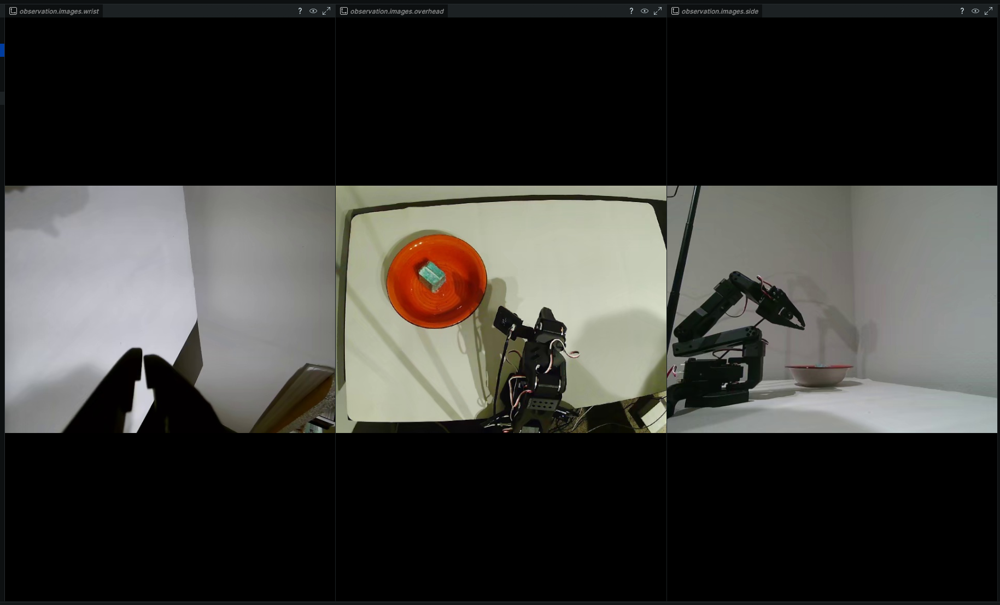

# SO-101 Playground

An experimental workspace for robot learning research with the SO-101 robot arm.

## Overview

> 🚧 **Work in Progress**  

This repository contains tools and experiments for:
- 🤖 **Imitation Learning** - Record and replay demonstrations using [LeRobot](https://github.com/huggingface/lerobot)
- 🎮 **Deep Reinforcement Learning** - Train policies with RL algorithms
- 🧠 **Vision-Language-Action Models** - Explore VLA-based control
- 🔬 **Ablation Studies** - Systematic experiments on task design and architecture

## Hardware Setup

| Component | Port/Device |
|-----------|-------------|
| Follower Arm | `/dev/ttyACM0` |
| Leader Arm | `/dev/ttyACM1` |
| Robot Camera | `/dev/video2` |



## Installation

```bash
# Clone the repository
git clone git@github.com:vvrs/so101-playground.git
cd so101-playground

# Create virtual environment
python -m venv .venv
source .venv/bin/activate

# Install dependencies (includes LeRobot from source)
pip install -e .

# Grant serial port access
sudo usermod -aG dialout $USER
# Log out and back in for group changes to take effect
```

## Quick Start

### 1. Calibrate the Arms

```bash
# Calibrate follower arm
lerobot-calibrate \
    --robot.type=so101_follower \
    --robot.port=/dev/ttyACM0 \
    --robot.id=my_follower_arm

# Calibrate leader arm
lerobot-calibrate \
    --teleop.type=so101_leader \
    --teleop.port=/dev/ttyACM1 \
    --teleop.id=my_leader_arm
```

### 2. Teleoperate

```bash
lerobot-teleoperate \
    --robot.type=so101_follower \
    --robot.port=/dev/ttyACM0 \
    --robot.id=my_follower_arm \
    --teleop.type=so101_leader \
    --teleop.port=/dev/ttyACM1 \
    --teleop.id=my_leader_arm
```

### 3. Record Demonstrations

```bash
python record.py --episodes 10 --task "Pick and place object"
```

### 4. View Camera

```bash
python view_camera.py --device 2
```

## Project Structure

```
so101-playground/
├── record.py          # Recording script for demonstrations
├── view_camera.py     # Camera viewer utility
├── CHEATSHEET.md      # Quick reference for common commands
├── pyproject.toml     # Project configuration
└── ablations/         # Experimental studies
```

## License

MIT
